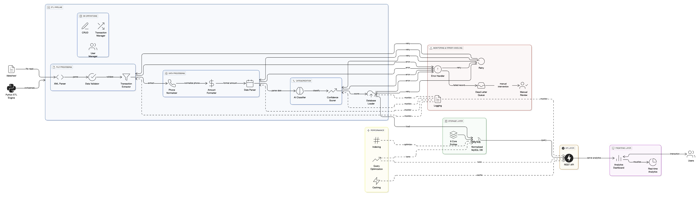

# MoMo SMS Data Processing System

A full-stack application that processes mobile money (MoMo) SMS data, categorizes transactions, and provides analytics through a web dashboard.

## Team

- **Team Name**: Team 11
- **Project**: MoMo SMS data processing system
- **Course**: Enterprise Web Development

### Team Members
- **Shima Serein** - Lead Developer
- **David Shumbusho** - Developer

## System Architecture



## Project Management

**Scrum Board**: [View Project Board](https://github.com/users/supserrr/projects/3/views/1?system_template=team_planning)

## Overview

This system processes XML-formatted SMS data from mobile money services, cleans and normalizes the data, categorizes transactions, and stores everything in a SQLite database. The web dashboard provides analytics and transaction insights.

## Quick Start

### Prerequisites

- Python 3.8 or later
- SQLite3

### Installation

1. **Clone the repository**
   ```bash
   git clone <repository-url>
   cd momo-data
   ```

2. **Install dependencies**
   ```bash
   pip install -r requirements.txt
   ```

3. **Configure environment**
   ```bash
   cp .env.example .env
   # Edit .env with your database settings
   ```

4. **Run the ETL process**
   ```bash
   ./scripts/run_etl.sh
   ```

5. **Start the web server**
   ```bash
   ./scripts/serve_frontend.sh
   ```

6. **Open the dashboard**
   Navigate to `http://localhost:8000` in your browser.

## Project Structure

```
├── README.md                    # This file
├── .env.example                 # Environment configuration template
├── requirements.txt             # Python dependencies
├── index.html                   # Web dashboard entry point
├── web/                         # Frontend assets
│   ├── styles.css              # Dashboard styling
│   ├── chart_handler.js        # Chart rendering and data fetching
│   └── assets/                 # Images and icons
├── data/                        # Data storage
│   ├── raw/                    # Raw XML input files
│   │   └── modified_sms_v2.xml # Sample MoMo SMS data
│   ├── processed/              # Cleaned and processed data
│   │   └── dashboard.json     # Dashboard data aggregates
│   ├── db.sqlite3             # SQLite database
│   └── logs/                  # System logs
│       ├── etl.log            # ETL process logs
│       └── dead_letter/       # Failed processing logs
├── database/                    # Database schema and setup
│   └── database_setup.sql     # Database schema with sample data
├── docs/                        # Documentation
│   └── ERD.jpg                  # Entity Relationship Diagram
├── examples/                    # JSON schema examples
│   ├── user_schema.json       # User entity JSON schema
│   ├── transaction_schema.json # Transaction entity JSON schema
│   ├── transaction_category_schema.json # Category entity JSON schema
│   ├── system_log_schema.json # System log JSON schema
│   ├── transaction_statistics_schema.json # Statistics JSON schema
│   ├── complete_transaction_example.json # Transaction with relations
│   └── json_schema_mapping.md # SQL to JSON mapping documentation
├── etl/                         # ETL pipeline
│   ├── config.py              # Configuration settings
│   ├── parse_xml.py           # XML parsing logic
│   ├── clean_normalize.py     # Data cleaning and normalization
│   ├── categorize.py          # Transaction categorization
│   ├── load_db.py             # Database operations
│   └── run.py                 # Main ETL runner
├── api/                         # Optional API layer
│   ├── app.py                 # FastAPI application
│   ├── db.py                  # Database helpers
│   └── schemas.py             # Pydantic models
├── scripts/                     # Utility scripts
│   ├── run_etl.sh             # ETL execution script
│   ├── export_json.sh         # JSON export script
│   └── serve_frontend.sh      # Frontend server script
└── tests/                       # Test suite
    ├── test_parse_xml.py
    ├── test_clean_normalize.py
    └── test_categorize.py
```

## Features

### Data Processing
- **XML Parsing**: Extracts transaction data from MoMo SMS XML files
- **Data Cleaning**: Normalizes phone numbers, amounts, and dates
- **Transaction Categorization**: Categorizes transactions by type
- **Database Storage**: Stores processed data in SQLite with proper relationships

### Web Dashboard
- **Transaction Analytics**: Charts and tables showing transaction patterns
- **User Statistics**: User activity and spending insights
- **Category Breakdown**: Transaction distribution by category
- **Real-time Updates**: Dashboard refreshes with new data

### API
- **RESTful Endpoints**: API for data access
- **JSON Responses**: Structured data in JSON format
- **Pagination**: Data retrieval for large datasets

## Configuration

### Environment Variables

Create a `.env` file based on `.env.example`:

```bash
# Database configuration
DATABASE_URL=sqlite:///data/db.sqlite3

# ETL settings
XML_FILE_PATH=data/raw/momo.xml
LOG_LEVEL=INFO
```

### ETL Configuration

Edit `etl/config.py` to customize:
- File paths
- Transaction categorization rules
- Data cleaning thresholds
- Database settings

## Usage

### Running the ETL Process

Process new XML data:
```bash
python etl/run.py --xml data/raw/momo.xml
```

### Starting the API Server

Run the FastAPI server:
```bash
python api/app.py
```

### Exporting Data

Export processed data to JSON:
```bash
./scripts/export_json.sh
```

## Development

### Running Tests

```bash
python -m pytest tests/
```

### Code Style

We follow PEP 8 Python style guidelines.

### Database Schema

The system uses a simplified, flat database schema for straightforward data processing:

#### Core Entities
- **Transactions** - Main transaction records with metadata and processing timestamps
- **ETL_Logs** - ETL process tracking and monitoring
- **Category_Stats** - Category-level analytics for dashboard performance
- **Transactions_Backup** - Data preservation and migration support

#### Key Features
- **Simplified Structure** - Flat, denormalized design for easy data access
- **Performance Optimization** - Indexes on frequently queried columns
- **Audit Trail** - Transaction history with processing timestamps
- **Flexible Metadata** - JSON storage for variable transaction attributes
- **Statistics Pre-calculation** - Dashboard performance through aggregated data

#### Database Design
- **ERD Documentation**: See `docs/ERD_Documentation.md` for design rationale
- **Schema Implementation**: Database structure for ETL processing
- **Data Processing**: Integration with XML parsing and categorization

#### Data Processing
The database supports transaction processing including:
- XML data parsing and normalization
- Transaction categorization with confidence scoring
- ETL process monitoring and logging
- Category-level statistics aggregation for analytics

## Troubleshooting

### Common Issues

**ETL process fails**
- Check XML file format and location
- Verify database permissions
- Review logs in `data/logs/etl.log`

**Dashboard not loading**
- Ensure ETL process completed
- Check that `data/processed/dashboard.json` exists
- Verify web server is running on correct port

**Database errors**
- Check SQLite file permissions
- Verify database schema is up to date
- Review database logs for constraint violations

### Logs

- **ETL Logs**: `data/logs/etl.log`
- **Failed Records**: `data/logs/dead_letter/`
- **Web Server Logs**: Check terminal output

## Database Foundation

### Entity Relationship Diagram (ERD)
- **Location**: `docs/ERD_Documentation.md`
- **Design**: Simplified schema with 4 core entities for ETL processing
- **Structure**: Flat, denormalized design for straightforward data access
- **Justification**: Design rationale explaining our simplified approach

### Database Implementation
- **Schema**: Implemented schema for transaction processing
- **Features**: Indexing, data validation, and ETL integration
- **Performance**: For dashboard analytics and processing
- **Flexibility**: JSON metadata storage and audit trails

### Data Processing Integration
- **ETL Pipeline**: Integration with XML parsing and categorization
- **Logging**: Process monitoring and error tracking
- **Analytics**: Pre-calculated statistics for dashboard performance
- **Backup**: Data preservation and migration capabilities

### Team Collaboration
- **Repository**: Updated with proper folder structure
- **Documentation**: README with database design
- **Organization**: Clear separation of concerns across directories

## Assignment Details

This project was developed by our team as part of the Enterprise Web Development course. The system demonstrates our skills in:

- Backend data processing and ETL pipelines
- Database design and management
- Frontend development and data visualization
- API design and implementation
- Full-stack application architecture
- Entity relationship modeling and database optimization